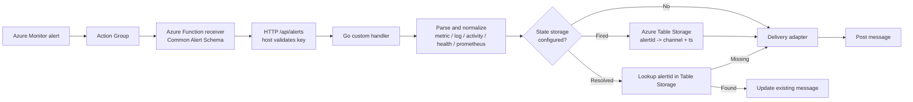

# Azure Alerts Proxy

Proxy **Azure Monitor alerts** to downstream notification services. The current implementation supports **Slack** as the delivery target, with room for adapters such as Microsoft Teams later.

An Azure Action Group calls the proxy directly through its native **Azure Function receiver** (with the Common Alert Schema enabled). The app parses metric, log, activity-log, resource/service-health, and **managed Prometheus** signals, then forwards the normalized alert to the configured delivery adapter. Today that adapter posts to Slack via a **bot token** and can record the alert->message mapping in **Azure Table Storage** so a later *Resolved* notification edits the same message in place. Without state storage, every notification posts a new message.

The app is a **Go custom handler** (a single compiled binary - fast cold start, no language-runtime retirement) that can run in Azure Functions from **`package.zip`** or as a portable container image.



## Features
- **Common Alert Schema** parsing for `Platform` (metric), log search, `Activity Log - *`, `ServiceHealth`, `ResourceHealth`, and `Prometheus`, plus a generic fallback.
- Delivery adapter architecture; **Slack is currently the only supported target**.
- Severity-coloured message (Sev4 grey -> Sev0/1 red; green when resolved), linked title, **markdown links** rendered, resource context, Prometheus labels table, and **Go to resource** / **Investigate with agent** buttons.
- **Resolve-in-place** via optional Table Storage; when storage is omitted, every alert posts a new message. **Per-alert channel** is selected via the `slack-channel` custom property or `SLACK_CHANNEL_ROUTES`.
- Bot token in **Key Vault**; managed identity for Key Vault + the state Table.

## Repository layout
| Path                                    | Purpose                                                                                                |
| --------------------------------------- | ------------------------------------------------------------------------------------------------------ |
| `main.go`                               | HTTP server (`/alerts`, `/cleanup`, `/healthz`) on `$FUNCTIONS_CUSTOMHANDLER_PORT`, `$PORT`, or `8080` |
| `host.json`                             | `customHandler` config (`handler.exe`, `enableForwardingHttpRequest`)                                  |
| `alerts/`, `cleanup/`                   | `function.json` for the HTTP trigger and the daily timer                                               |
| `internal/alert/`                       | Common Alert Schema types, parser, per-signal extractors                                               |
| `internal/slack/`                       | slack-go client + message builder                                                                      |
| `internal/state/`                       | Table Storage state store (`aztables` + managed identity)                                              |
| `internal/config/`, `internal/handler/` | config + orchestration                                                                                 |
| `docs/samples/`                         | Common Alert Schema examples copied from Microsoft Learn                                               |
| `docs/slack-app-manifest.yml`           | Slack app manifest (scopes/bot user)                                                                   |
| `Dockerfile`, `.goreleaser.yml`         | Container runtime and release packaging                                                                |

## 1. Create the Slack bot
Create an app from [`docs/slack-app-manifest.yml`](docs/slack-app-manifest.yml) at <https://api.slack.com/apps> -> **From a manifest**, install it, and copy the **Bot User OAuth Token** (`xoxb-...`). Scopes: `chat:write` + `chat:write.public`.

## 2. Deploy with Terraform
The Terraform module is being split into a dedicated repository for Terraform Registry publishing.

```hcl
module "monitor_slack" {
  source  = "bonddim/alerts-proxy/azurerm"
  version = "0.1.0"

  name_prefix         = "amslack"
  location            = "eastus"
  resource_group_name = "amslack-rg"

  slack_bot_token       = var.slack_bot_token # ephemeral; kept out of state
  slack_default_channel = "#alerts"
}
```

```bash
TF_VAR_slack_bot_token='xoxb-...' terraform apply
```

## Docker
The container listens on `8080` by default. Slack is the currently supported delivery target, so Slack settings are required:

```bash
docker run --rm -p 8080:8080 \
  -e SLACK_BOT_TOKEN=xoxb-... \
  -e SLACK_DEFAULT_CHANNEL='#alerts' \
  ghcr.io/bonddim/azure-alerts-proxy:latest
```
Add `STATE_STORAGE_CONNECTION_STRING` or `STATE_STORAGE_ENDPOINT` to enable stateful retries and resolved-message updates in any environment.

## Configuration (app settings)
| Setting                           | Required             | Description                                                                 |
| --------------------------------- | -------------------- | --------------------------------------------------------------------------- |
| `SLACK_BOT_TOKEN`                 | yes                  | Bot token (set by Terraform as a Key Vault reference)                       |
| `SLACK_DEFAULT_CHANNEL`           | yes                  | Default channel when no `slack-channel` custom property is present          |
| `SLACK_CHANNEL_ROUTES`            | no                   | JSON channel routing rules matched before falling back to the default       |
| `STATE_TABLE_NAME`                | no (`alertmessages`) | Table name for alert -> message records                                     |
| `STATE_STORAGE_ENDPOINT`          | no                   | Table endpoint (managed identity in Azure). Enables state when set.         |
| `STATE_STORAGE_CONNECTION_STRING` | no                   | Connection string for local dev or non-Azure state. Enables state when set. |
| `STATE_RETENTION_DAYS`            | no (`30`)            | Age after which records are purged                                          |
| `AZURE_PORTAL_BASE`               | no                   | Portal base URL for sovereign clouds                                        |

If neither storage setting is present, the app still runs: fired and resolved notifications post new Slack messages, retries are not deduplicated, and cleanup is skipped. `AzureWebJobsStorage` is still used as a fallback for local Azure Functions state.

Example `SLACK_CHANNEL_ROUTES` for Prometheus namespace routing:

```json
[
  {
    "service": "Prometheus",
    "labels": { "namespace": "production" },
    "channel": "#prod-alerts"
  },
  {
    "service": "Prometheus",
    "labels": { "namespace": "qa" },
    "channel": "#qa-alerts"
  }
]
```

## Releasing

Push a tag `vX.Y.Z`. [GoReleaser](.goreleaser.yml) builds `handler.exe` for `windows/amd64`, packages `handler.exe` + `host.json` + `alerts/` + `cleanup/` into `package.zip`, creates the GitHub Release, and publishes `linux/amd64` + `linux/arm64` images to GHCR.

For local release dry runs, see [GoReleaser Snapshots](CONTRIBUTION.md#goreleaser-snapshots).
